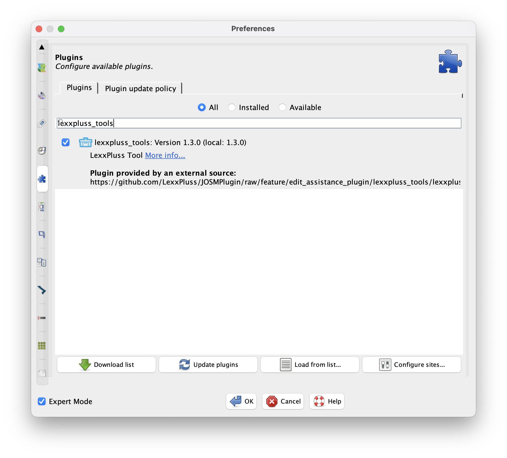
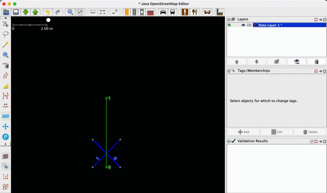
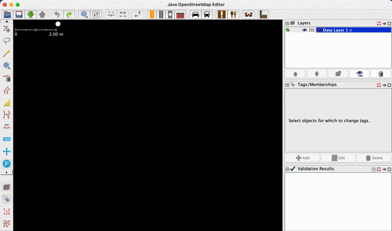
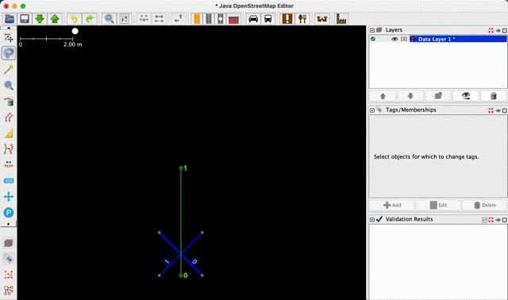
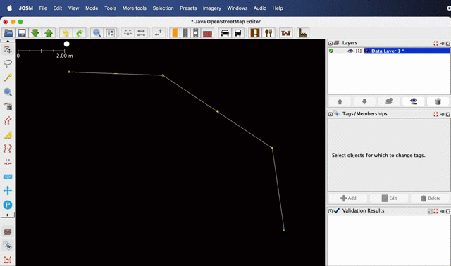
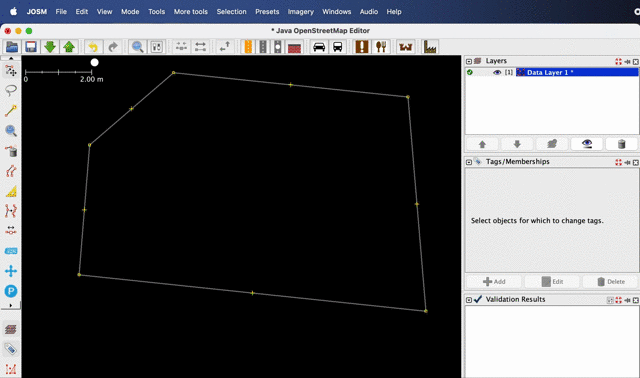
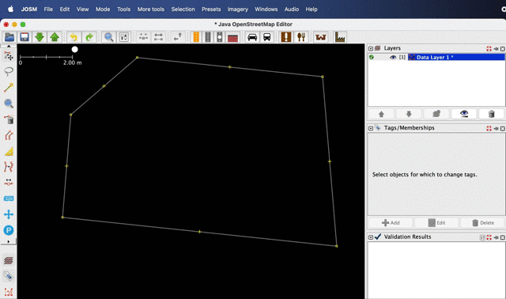
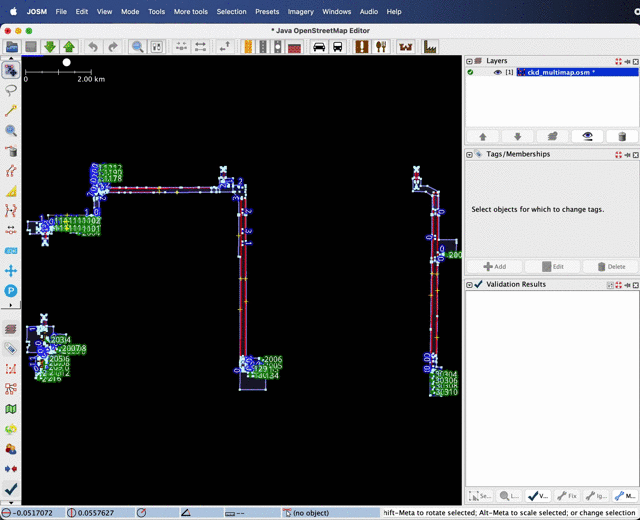
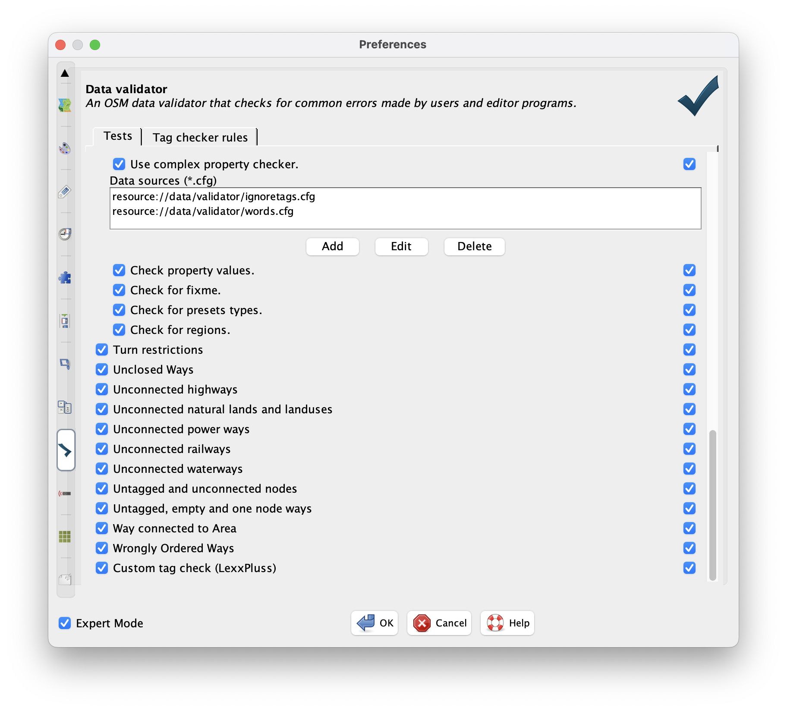
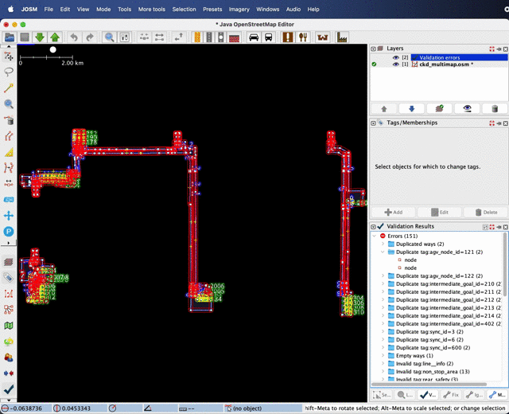

# LexxPluss tools plugin for JOSM

## Install

Search for and install lexxpluss_tools from the JOSM plugin configuration screen.

## Features

1. Insertion of templated AGV lines.
2. Insertion of templated parking areas.
3. Precise movement at 5 cm, 20 cm.
4. Conversion of Way to intermediate goals.
5. Conversion of Way to AMR goals.
6. Conversion of Area to movable area.
7. Conversion of Area to sync area.
8. Conversion of Area to safety area.
9. Conversion of Area to non-stop area.
10. Tag checking of LexxPluss specifications.

The plugin's functionality automatically sets the Tag and unique ID; manual setting of the Tag is not required.

## AGV Line

Select AGV Line Mode on the left of the application screen and click on the map to insert a templated AGV line.

## Parking Area

Select Parking Area Mode on the left of the application screen and click on the map to insert a templated parking area.

## Precise Movement

Select a node or Way in Select Mode on the left of the application screen, then select Key Move Mode and press the cursor key to move the node or Way 20 cm in that direction.
Pressing the cursor key while holding down the Shift key moves the node or Way by 5 cm.

## Way to Intermediate Goals

Selecting a Way that has already been drawn in Draw nodes mode and choosing Set Intermediate Goal from the More tools menu will convert the Way to an Intermediate Goal.

## Way to AMR Goals

Selecting a Way that has already been drawn in Draw nodes mode and choosing Set AMR Goal from the More tools menu will convert the Way into an AMR Goal.

## Area to Movable Area

Select an Area that has already been drawn in Draw nodes mode and choose Set Movable Area from the More tools menu to convert the Area into a Movable Area.

## Area to Sync Area

Select an Area that has already been drawn in Draw nodes mode and choose Set Sync Area from the More tools menu to convert the Area into a Sync Area.

## Area to Safety Area

Select an Area that has already been drawn in Draw nodes mode and choose Set Safety Area from the More tools menu to convert the Area into a Safety Area.

## Area to Non-Stop Area

Select an Area that has already been drawn in Draw nodes mode and choose Set Non-Stop Area from the More tools menu to convert the Area into a Non-Stop Area.

## Tag Checking

When the Validation window is displayed and the Validation button is clicked, a LexxPluss specification tag check is carried out and the results are displayed.

Items checked by the Tag check in the LexxPluss specification include.

1. a Tag that is not used by LexxPluss is set.
2. a non-numeric value is set for a Tag that requires a numerical value.
3. wrong Value is set.
4. wrong Tag combination is set.
5. wrong combination of Tags for Node and Way
6. duplicated Tag values (ID)

Validation of the JOSM standard, which is not related to the LexxPluss specification, is also carried out, so it is advisable to uncheck unnecessary items in the Validator settings window. (The last item displayed is the LexxPluss specification Tag check.)

By double-clicking on a node in the Validation windows and selecting Zoom to selection from the View menu, the error node can be displayed.

